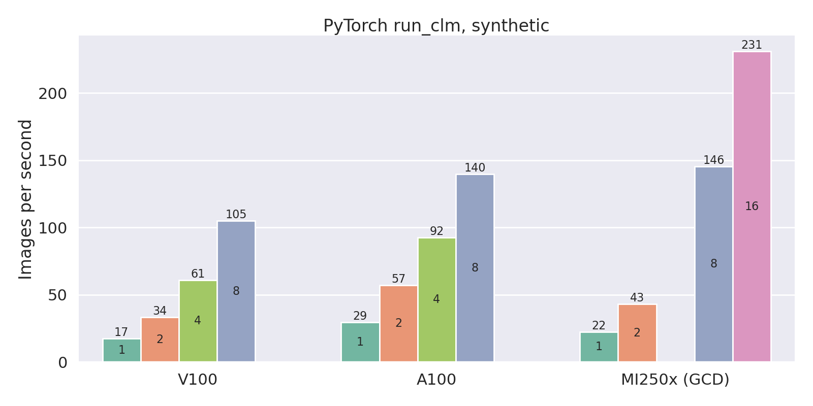
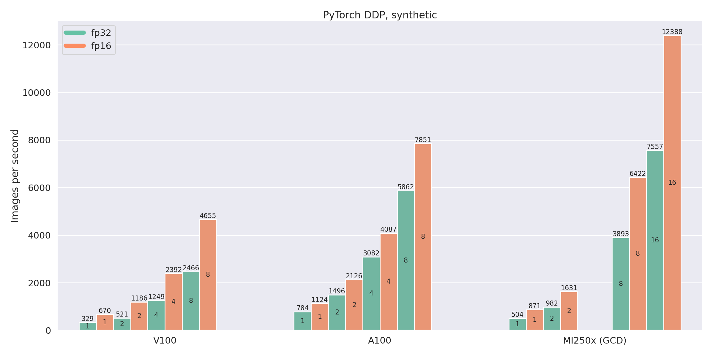
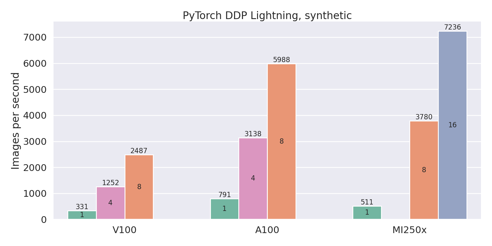
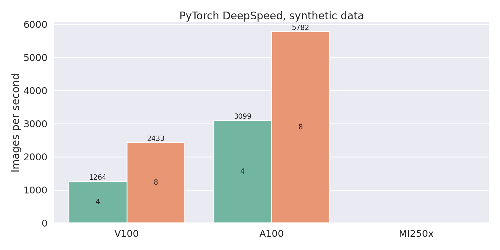

# Machine learning benchmarks

Collection of various machine learning benchmarks together with Slurm scripts
for CSC's supercomputers.

The benchmarks themselves (Python code) can be found in the `benchmarks`
directory. Main run scripts are in the root directory as `*.sh` files. The Slurm
settings have been separated into their own scripts in the `slurm` directory.

Typical usage would be to first select a benchmark (e.g., PyTorch synthetic) and
then appropriate Slurm settings (e.g., Mahti with 4 GPUs on Mahti, single node,
no MPI). The command would then be:

```bash
sbatch slurm/mahti-gpu4.sh pytorch-synthetic.sh
```

## Available run scripts

Slurm run scripts can be found in the `slurm` directory, these are named as
`[puhti|mahti]-[cpu|gpu]N.sh` where `N` is the number of CPUs or GPUs reserved.

Scripts are all single-node, single MPI task unless it ends with `-mpi.sh`.
Tasks with the `-mpi.sh` ending launch a separate MPI task for each GPU,
assuming 4 GPUs per node. For example `mahti-gpu8-mpi.sh` reserves two nodes,
with 4 GPUs (and thus 4 MPI tasks) per node, giving a total of 8 GPUs (and 8 MPI
tasks).


## Available benchmarks

| Benchmark                 | Script name                    | Data               | Multi-node |
| ---------                 | -----------                    | ----               | ---        |
| PyTorch synthetic         | `pytorch-synthetic.sh`         | synthetic          | Horovod    |
| PyTorch DDP               | `pytorch-ddp.sh`               | synthetic/ImageNet | DDP        |
| PyTorch Horovod           | `pytorch-horovod.sh`           | synthetic/ImageNet | Horovod    |
| PyTorch DDP Lightning     | `pytorch-ddp-lightning.sh`     | synthetic/ImageNet | DDP        |
| PyTorch Horovod Lightning | `pytorch-horovod-lightning.sh` | synthetic/ImageNet | Horovod    |
| TensorFlow CNN            | `tensorflow-cnn.sh`            | synthetic/ImageNet | -          |

The different benchmarks are described below in more detail. 


### run_clm

Fine-tuning GPT-like model on WikiText-2, directly from [Huggingface
Language modeling
examples](https://github.com/huggingface/transformers/tree/main/examples/pytorch/language-modeling).



Run example with a full node GPUs (in this case 8 GPUs on LUMI):

```bash
sbatch slurm/lumi-gpu8.sh pytorch-clm.sh
```

Run example with two full nodes GPUs (in this case 16 GPUs on LUMI):

```bash
sbatch slurm/lumi-gpu16.sh pytorch-clm.sh
```


### PyTorch synthetic

Originally based on [Horovod's example script with the same name][1]. Note that
the original script used a single fixed random batch which was feed to the
network again and again. Some systems and setups are able to optimize this
scenario giving very unrealistic results. We have modified the script to
generate a new random batch each time.

Runs with "resnet50" model by default, but also supports "inception_v3" and
other [models from torchvision.models][2].

Run example with single GPU:

```bash
sbatch slurm/mahti-gpu1.sh pytorch-synthetic.sh
```

Run example with 4 GPUs. Note that you can also add arguments to be given to
the Python script:

```bash
sbatch slurm/mahti-gpu4.sh pytorch-synthetic.sh --batch-size=32
```

Using 8 GPUs (i.e., 2 nodes) with Horovod and MPI:

```bash
sbatch slurm/mahti-gpu8-mpi.sh pytorch-synthetic.sh
```

## PyTorch DDP and PyTorch Horovod

PyTorch benchmark using Distributed Data Parallel or Horovod for handling
multiple GPUs.



Run example with 4 GPUs on Puhti using synthetic data and DDP:

```bash
sbatch slurm/puhti-gpu4.sh pytorch-ddp.sh
```

Run example with 8 GPUs (on 2 nodes) using real ImageNet data and DDP:

```bash
sbatch slurm/puhti-gpu8.sh pytorch-ddp.sh --data
```

Run example with 8 GPUs (2 nodes) using Horovod:

```bash
sbatch slurm/puhti-gpu8-mpi.sh pytorch-horovod.sh
```

**NOTE:** Using DataLoader with Horovod still has some problems on Puhti when
using multiple processes. It seems to freeze at random times. This is still
being investigated


## PyTorch DDP with Lightning

PyTorch Lightning example using DDP. Runs with "resnet50" model by
default, but also supports "inception_v3" and other [models from
torchvision.models][2].



DDP (as of PyTorch 1.13) needs to be run as single task per GPU:

```bash
sbatch slurm/puhti-gpu4-mpi.sh pytorch-ddp-lightning.sh  # single node
sbatch slurm/puhti-gpu8-mpi.sh pytorch-ddp-lightning.sh  # two nodes
```

The scripts supports `--data` option to use real ImageNet data instead
of synthetic data and `--fp16` to enable 16-bit precision for some
operations.

## PyTorch DeepSpeed



DeepSpeed example, 4 GPUs with synthetic data:

```bash
sbatch slurm/puhti-gpu4.sh pytorch-deepspeed.sh
```

8 GPUs, 2 nodes with ImageNet data:

```bash
sbatch slurm/puhti-gpu8-mpi.sh pytorch-deepspeed.sh --data
```

## TensorFlow CNN

Uses [`tf_cnn_benchmarks.py`][3] directly from TensorFlow's GitHub (as a git
submodule here).

Run example:

```bash
sbatch slurm/mahti-gpu1.sh tensorflow-cnn.sh
```

Horovod:

```bash
sbatch slurm/mahti-gpu8-mpi.sh tensorflow-cnn.sh
```

With real data:

```bash
sbatch slurm/mahti-gpu1.sh tensorflow-cnn.sh --data
```

Horovod with real data:
```bash
sbatch slurm/mahti-gpu8-mpi.sh tensorflow-cnn.sh --data
```


[1]: https://github.com/horovod/horovod/blob/master/examples/pytorch/pytorch_synthetic_benchmark.py
[2]: https://pytorch.org/vision/stable/models.html
[3]: https://github.com/tensorflow/benchmarks/blob/master/scripts/tf_cnn_benchmarks/tf_cnn_benchmarks.py
